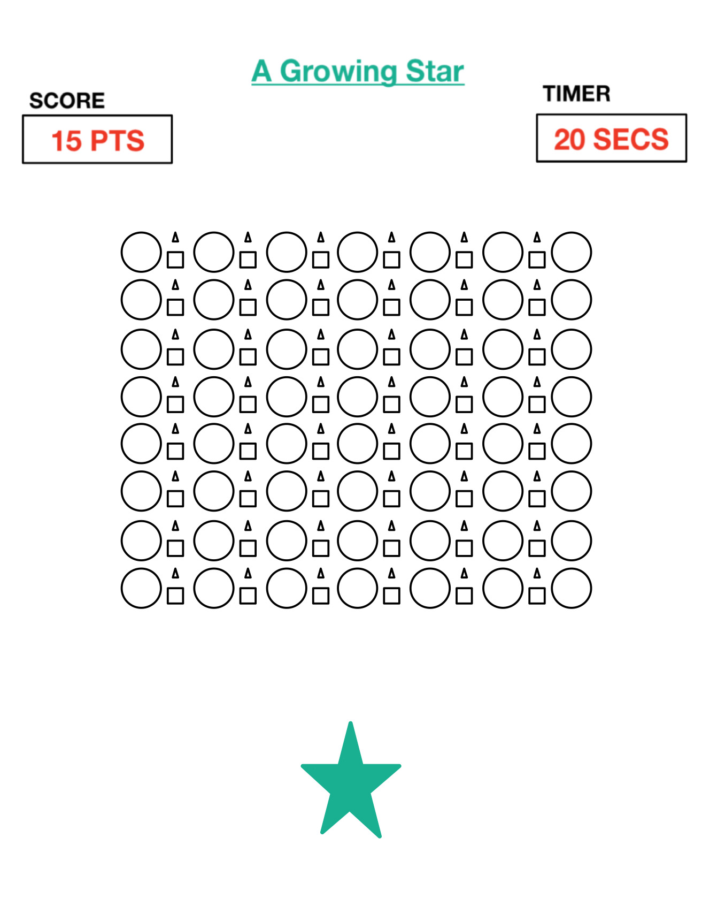

## About Game

- This is a click-based game
- You will only have 5 seconds to click as many shapes as you can
- Each shape generates a different point values between 0 to 20 
- Based on these values, you will receive your score once the timer ends 
- Your ultimate goal is to click as many/most shapes as you can in order to clear the board and receive max amount of points 

<<<<<<< HEAD
 ## How To Play:
=======
 ## How To Play
 
 1. Click **"Start Game"**
 	- This initializes the game and timer to begin game
 2. Once timer has started, quickly click as many shapes as you can
 3. After timer is over, the amount of points you receive will be displayed 
 4. Press **"Restart Game"** to play again
>>>>>>> e10e0cf7b067045fb153176f9dc3953aaf0cf04f

## Actual Game

<<<<<<< HEAD

## Wireframe
=======
## Game

This is the current game display

## Wire Frame
>>>>>>> e10e0cf7b067045fb153176f9dc3953aaf0cf04f

I originally wanted to have a variety of shapes and each shape and size would be a different, but consistent point value. Then, as the points would increase, there would be a star at the bottom growing, as your point value increases as well.

## Known Bugs

The only known bug that I found was, you can click all the shapes even before pressing the **"Start Game"** button, and all points will log in even before starting the game. In short, you can win the game before initializing start/timer.

<<<<<<< HEAD
## SOURCES:
=======
## Sources
>>>>>>> e10e0cf7b067045fb153176f9dc3953aaf0cf04f

- [Stack Overflow](www.stackoverflow.com) 
- [W3 Schools](www.w3schools.com) 
- [CSS Tricks](www.css-tricks.com)
- Youtuber -- The Coding Train 

